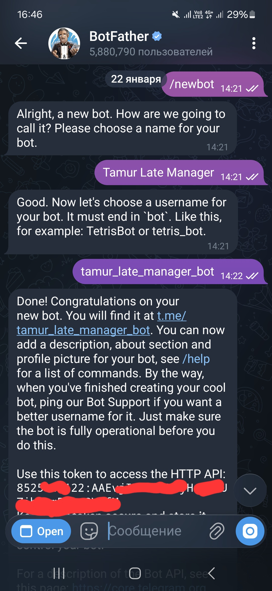

# Инструкция

## 1. Создать бота

Открыть [@BotFather](https://t.me/BotFather) в телеграме:
1. `/newbot`
2. Ввести имя бота (например: `Учет опозданий`)
3. Ввести username (например: `late_mng_bot`)
4. Скопировать токен



## 2. Подготовить файлы

Скачать и положить в одну папку:
- `docker-compose.yml`
- `db_init.sql`

Там же создать файл `.env` (см. `.env.example`):
```
# Nyagram
BOT_TOKEN=7123456789:AAHxxxxxxxxxxxxxxxxxxxxxxxxxx
BOT_USERNAME=@late_mng_bot

# Postgres
DB_NAME=late_mng
SPRING_DATASOURCE_USERNAME=postgres
SPRING_DATASOURCE_PASSWORD=your_password_here
```

## 3. Запуск

```
sudo docker-compose up -d
```

Образ бота — `darinax/late-manager-java`

Документация nyagram — https://nyagram.kaleert.pro/
